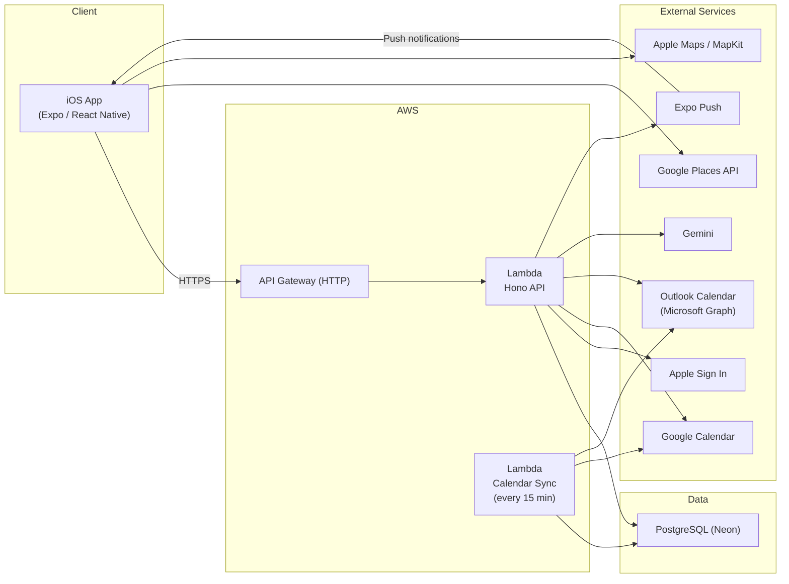

# Gather

A social scheduling app that syncs calendars between friends so you can find mutual free time and make plans in seconds.

Available on the [iOS App Store](https://apps.apple.com/us/app/gather-plan-with-friends/id6759443297).

## What It Does

Connect your Apple, Google, or Outlook calendar and Gather keeps your availability synced in the background. When you want to make a plan, choose friends and a date or date range, and Gather surfaces every time slot where everyone is free. Pick a time, add a title and location, and the event is created with invitations sent automatically.

Friends only see whether you're free or busy, never event names, descriptions, or other calendar details. It also includes manual blocked time windows, friend groups for one-tap planning, RSVPs with alternative-time proposals, Google Places-powered location search with native Apple Maps previews and directions, push notifications, and two-way calendar sync.

## Architecture



The iOS app and backend share a contract via an OpenAPI spec (`backend/openapi.json`). The frontend client is auto-generated from the spec using [Hey API](https://heyapi.dev/).

## Overview

**iOS app** (`gather/`) — React Native + [Expo](https://expo.dev/) TypeScript app built for iOS. Uses [expo-router](https://docs.expo.dev/router/introduction/) for file-based navigation, [Tamagui](https://tamagui.dev/) for UI primitives and theming, and [TanStack Query](https://tanstack.com/query/latest) for server state. The API client is auto-generated with [Hey API](https://heyapi.dev/) from the backend's OpenAPI spec. Native capabilities like Apple Sign In, calendar access, notifications, haptics, and maps are handled through Expo modules, with the [Google Places API](https://developers.google.com/maps/documentation/places/web-service) powering place search and Apple Maps handling in-app previews.

**Backend** (`backend/`) — [Hono](https://hono.dev/) app running on AWS Lambda behind API Gateway. Uses [Drizzle ORM](https://orm.drizzle.team/) with PostgreSQL on [Neon](https://neon.com/), plus [Zod](https://zod.dev/) and [`@hono/zod-openapi`](https://github.com/honojs/middleware/tree/main/packages/zod-openapi) for request validation and OpenAPI generation. A separate scheduled Lambda syncs connected calendars in the background. Infrastructure is managed with [Serverless Framework](https://www.serverless.com/), and the backend integrates with Apple Sign In, Google Calendar, Outlook Calendar via Microsoft Graph, Gemini, and Expo push notifications.

## Project Structure

```
gather/                     # iOS app (Expo / React Native)
  app/                      # File-based routes (expo-router)
    (tabs)/                 # Main tab screens (home, plan, friends, profile)
    (auth)/                 # Login / onboarding
    events/, friends/, …    # Detail screens
  components/ui/            # Shared UI components
  lib/                      # Hooks, contexts, API client, utilities

backend/                    # Serverless API
  lambdas/                  # Lambda entry points (api.ts, calendar-sync.ts)
  src/
    api/                    # Route modules (auth, events, friends, calendars, …)
    db/                     # Drizzle schema and connection
    services/               # Business logic
    middleware/              # Auth, validation, error handling
  drizzle/                  # SQL migrations
  scripts/                  # OpenAPI generation, DB migration, seed data
```
